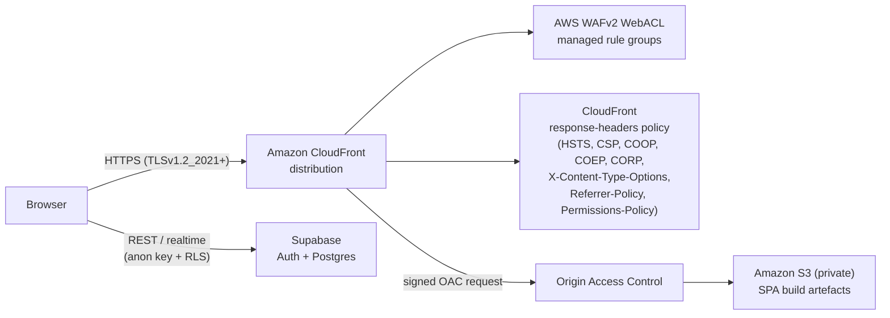
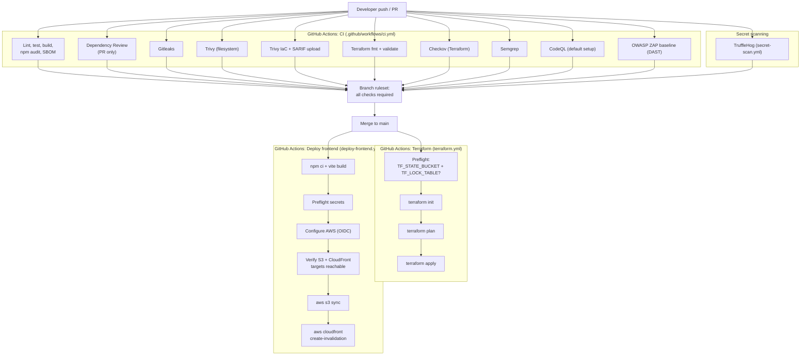
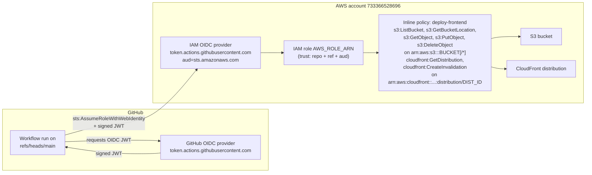

# 02 — Architecture

Three diagrams, one per question a reviewer will ask:

1. *"What happens when a user loads the site?"*
2. *"What happens when a developer pushes code?"*
3. *"How does GitHub Actions get into AWS without static credentials?"*

## 1. Runtime request path

**Key properties**

- S3 has **no public access** and no bucket policy granting anonymous reads. Objects are only reachable through the CloudFront OAC — confirmed by Checkov (`CKV_AWS_53/54/55/56` enforced in [checkov.yaml](../../checkov.yaml)) and by the Terraform module ([terraform/modules/aws_static_site/main.tf](../../terraform/modules/aws_static_site/main.tf)).
- TLS is `TLSv1.2_2021` whenever a custom ACM certificate is wired up; with the default `*.cloudfront.net` certificate, AWS itself restricts the distribution to `TLSv1`, which is documented as a Semgrep false positive in [incident 13](06-incidents/13-semgrep-cloudfront-tls.md).
- All security-relevant response headers are emitted by a CloudFront **response-headers policy** (Terraform resource in the static-site module), *not* by the SPA, so they are enforced even if the build regresses.
- The Supabase path is intentionally unmediated by CloudFront — auth/data requests go browser→Supabase over HTTPS using the public anon key with RLS on the database side.

## 2. CI/CD pipeline (push → merge → deploy)

**Key properties**

- Every scanner runs on **every push and PR**. The `main` branch has a ruleset requiring all of the above checks to be green before merge — which is why there are intermediate PRs in the history (#18, #20, #22, etc.) rather than straight-to-main pushes.
- The Terraform job is *not* triggered on PRs — it only runs on pushes to protected branches and manual dispatch. This was a deliberate OIDC-scoping decision documented in [incident 15](06-incidents/15-terraform-oidc-pr-trust.md).
- Both the Terraform and Deploy jobs have **preflight steps** that check for required secrets (and, in the deploy case, verify the AWS resources actually exist and are reachable) *before* they try to assume the AWS role or mutate anything. See [incident 17](06-incidents/17-terraform-backend-secrets.md) and [incident 18](06-incidents/18-deploy-missing-aws-targets.md).
- Dependabot is enabled for npm, GitHub Actions, Docker, and Terraform providers. Its PRs (#1–17 in the history) flow through the same ruleset; they cannot bypass the scanners.

## 3. OIDC trust model

**Key properties**

- No `aws_access_key_id` / `aws_secret_access_key` in GitHub secrets. The only AWS-related secrets are **ARNs** (`AWS_ROLE_ARN`, `AWS_DEPLOY_ROLE_ARN`) and **resource IDs** (`S3_BUCKET_ID`, `CLOUDFRONT_DISTRIBUTION_ID`, `TF_STATE_BUCKET`, `TF_LOCK_TABLE`) — none of which are credentials.
- The role's **trust policy** pins the allowed GitHub subject (`repo:asadyare/secure-banking-app:ref:refs/heads/main`) and audience (`sts.amazonaws.com`) so tokens from forks, feature branches, or other repos are rejected. Bootstrap detail in [docs/github-oidc-aws.md](../github-oidc-aws.md).
- The inline `deploy-frontend` policy uses **explicit resource ARNs** — not `"Resource": "*"`. The 403/AccessDenied debugging session in [incident 19](06-incidents/19-deploy-iam-permissions-gap.md) walks through the consequence of getting that wrong.
