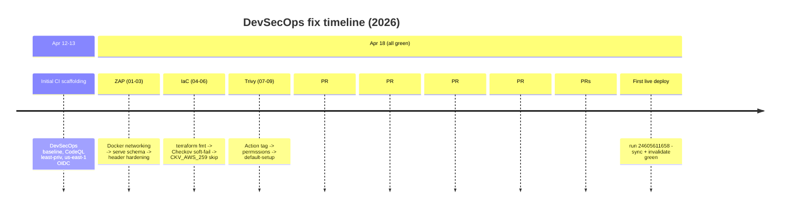

# 05 — Incident log

A single-page index of every blocking issue fixed during this project. Each entry links to the full deep-dive in [`06-incidents/`](06-incidents/) and to the exact commit or PR that landed the fix.

## Phase 1 — DAST: make ZAP useful

- **[01 — ZAP could not reach the preview server on Linux](06-incidents/01-zap-docker-networking.md)** — `host.docker.internal` does not resolve inside the ZAP container on Linux runners; target `127.0.0.1` with `--network=host`. Fix: [`6981103`](https://github.com/asadyare/secure-banking-app/commit/6981103).
- **[02 — `serve` rejected `serve.json` because of `$schema`](06-incidents/02-zap-serve-schema.md)** — `serve-handler` validates with `additionalProperties: false`; drop the `$schema` hint. Fix: [`53c75e6`](https://github.com/asadyare/secure-banking-app/commit/53c75e6).
- **[03 — ZAP flagged nine missing security headers](06-incidents/03-zap-security-headers.md)** — emit production headers on the preview server via `serve.json`, and add documented `IGNORE` rules for irreducible findings. Fix: [`aa17667`](https://github.com/asadyare/secure-banking-app/commit/aa17667) + [`591d77f`](https://github.com/asadyare/secure-banking-app/commit/591d77f).

## Phase 2 — IaC gates

- **[04 — `terraform fmt -check` failed on trailing whitespace](06-incidents/04-terraform-fmt.md)** — run `terraform fmt -recursive`. Fix: [`69eb0c6`](https://github.com/asadyare/secure-banking-app/commit/69eb0c6).
- **[05 — Checkov rejected `--soft-fail false`](06-incidents/05-checkov-soft-fail-arg.md)** — `--soft-fail` is a boolean switch; drop the spurious value. Fix: [`67bdfcf`](https://github.com/asadyare/secure-banking-app/commit/67bdfcf).
- **[06 — Checkov `CKV_AWS_259` demanded HSTS preload](06-incidents/06-checkov-ckv-aws-259.md)** — skip with rationale; expose `hsts_preload` as an operator-controlled variable. Fix: [`f5099a2`](https://github.com/asadyare/secure-banking-app/commit/f5099a2).

## Phase 3 — Trivy (action, upload, findings)

- **[07 — `aquasecurity/trivy-action@0.28.0` no longer resolves](06-incidents/07-trivy-action-tag.md)** — tag yanked; pin to full SHA `57a97c7…` with `# v0.35.0`. Fix: [`2b89f70`](https://github.com/asadyare/secure-banking-app/commit/2b89f70).
- **[08 — Trivy SARIF upload `Resource not accessible by integration`](06-incidents/08-trivy-sarif-permissions.md)** — grant `actions: read`; bump to `upload-sarif@v4`. Fix: [`6f03cce`](https://github.com/asadyare/secure-banking-app/commit/6f03cce).
- **[09 — SARIF upload failed with `Code scanning is not enabled`](06-incidents/09-trivy-sarif-default-setup.md)** — make Security-tab upload best-effort, always archive SARIF as a workflow artifact. Fix: [`67b3f1d`](https://github.com/asadyare/secure-banking-app/commit/67b3f1d).
- **[10 — Trivy reported phantom CVEs from a stale `bun.lock`](06-incidents/10-trivy-findings-lockfile.md)** — delete the stale lockfile. Fix: PR [#18](https://github.com/asadyare/secure-banking-app/pull/18).
- **[11 — Trivy `AVD-DS-0002`: container running as root](06-incidents/11-trivy-dockerfile-nonroot.md)** — switch to `nginxinc/nginx-unprivileged` + `USER nginx` + port 8080. Fix: PR [#18](https://github.com/asadyare/secure-banking-app/pull/18).
- **[12 — Trivy IaC `AVD-AWS-0011` + `AVD-AWS-0132`](06-incidents/12-trivy-iac-waf-kms.md)** — documented suppressions in [.trivyignore](../../.trivyignore); WAF + CMK exposed as opt-in variables. Fix: PR [#18](https://github.com/asadyare/secure-banking-app/pull/18).

## Phase 4 — SAST / CodeQL

- **[13 — Semgrep false positive on CloudFront TLS](06-incidents/13-semgrep-cloudfront-tls.md)** — inline `# nosemgrep` with rationale: AWS enforces `TLSv1` on the default certificate. Fix: PR [#18](https://github.com/asadyare/secure-banking-app/pull/18) (cherry-picked from #19).
- **[14 — CodeQL "advanced configs cannot be processed when default setup is enabled"](06-incidents/14-codeql-default-vs-custom.md)** — delete the custom `codeql.yml`; default setup is the source of truth. Fix: PR [#20](https://github.com/asadyare/secure-banking-app/pull/20).

## Phase 5 — OIDC, Terraform, secret scanning

- **[15 — Terraform OIDC `Not authorized to perform sts:AssumeRoleWithWebIdentity`](06-incidents/15-terraform-oidc-pr-trust.md)** — trust policy pinned to `refs/heads/main`; stop triggering Terraform workflow on `pull_request`. Fix: PR [#20](https://github.com/asadyare/secure-banking-app/pull/20).
- **[16 — `trufflesecurity/trufflehog@v3` does not resolve](06-incidents/16-trufflehog-action-tag.md)** — no floating major tag; pin to SHA `47e7b7c…` (v3.94.3) and add `FORCE_JAVASCRIPT_ACTIONS_TO_NODE24`. Fix: PR [#20](https://github.com/asadyare/secure-banking-app/pull/20).

## Phase 6 — Preflight: graceful handling of missing AWS state

- **[17 — Terraform init failed on empty backend secrets](06-incidents/17-terraform-backend-secrets.md)** — add a `Check backend secrets` preflight step; skip init/plan/apply with an actionable summary when `TF_STATE_BUCKET` / `TF_LOCK_TABLE` are unset. Fix: PR [#21](https://github.com/asadyare/secure-banking-app/pull/21).
- **[18 — `aws s3 sync` crashed with `NoSuchBucket`](06-incidents/18-deploy-missing-aws-targets.md)** — two-stage preflight (secrets presence, then `head-bucket` + `get-distribution` reachability). Fix: PR [#22](https://github.com/asadyare/secure-banking-app/pull/22).

## Phase 7 — First live deploy

- **[19 — Deploy role had no S3 or CloudFront permissions (and policy placeholders)](06-incidents/19-deploy-iam-permissions-gap.md)** — attach a least-privilege inline policy scoped to the real bucket + distribution ARNs; verify with `get-role-policy`. Deep-diagnostic preflight lands in PRs [#24](https://github.com/asadyare/secure-banking-app/pull/24) + [#25](https://github.com/asadyare/secure-banking-app/pull/25). First successful end-to-end deploy: run [`24605611658`](https://github.com/asadyare/secure-banking-app/actions/runs/24605611658).

## Timeline at a glance

